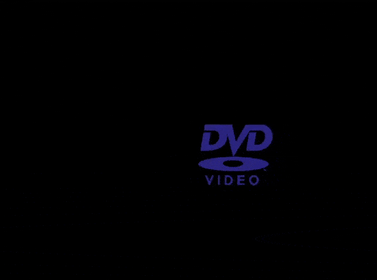

# Simple SDL DVD

# Content
- [What is SDL?](#what-is-sdl)
- [About this project](#about-this-project)
    - [Compatibility](#compatibility)
    - [Showcase](#showcase)
- [How to?](#how-to)
    - [Prerequisites](#prerequisites)
    - [Init](#init)
    - [Build and Run](#build-and-run)
- [Lazy](#lazy)

# What is SDL?
> Simple DirectMedia Layer is a cross-platform development library 
> designed to provide low level access to audio, keyboard, mouse, joystick, 
> and graphics hardware via OpenGL and Direct3D.

[SDL official page.](https://www.libsdl.org/)

# About this project
Pet project of mine, to learn and work with SDL along with Go.

## Compatibility
Currently tested only on MacOS arm64.
Feel free to test and open PRs/issues to include/fix for other OS.

## Showcase


# How to?
## Prerequisites
* Go >= 1.23.4
* [SDLv2](https://github.com/veandco/go-sdl2?tab=readme-ov-file#requirements)

## Init
```sh
    go mod tidy
```

## Build and Run
In the cloned directory:
```sh
    go build . && ./dvd
```

# Lazy
You can download pre-built app (executable) only in this [folder.](https://github.com/star-light-nova/dvd-video-sim/tree/master/download/)

__Try hitting `c` while running the app.__
